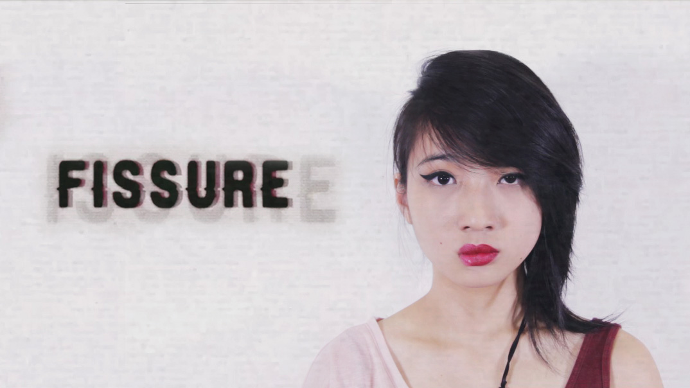

Nominated for Best Visual Effects (National Youth Film Awards 2015)

<iframe src="https://player.vimeo.com/video/131540840" width="100%" height="255" frameborder="0" allow="autoplay; fullscreen" allowfullscreen></iframe>

FISSURE is a 2nd Year Student Studio Project in collaboration with Interaction Design students, given the theme of "What does Visual Effects mean to you?".

I was the project team leader as well as the producer and supervised the overall production from pre to post, in charge of logistics, planning and scheduling of production and talent. Also, I did the texturing, lighting and compositing of the camera and knife in Maya & Nuke.

From this project, I have learnt to troubleshoot technical problems, communicate and work with people from various backgrounds and focused more on storytelling with the aid of visual effects.

The collaboration was aimed to simulate a work environment where different departments would come together and work on a project. This project challenges our communication with one another as we work together, be more understanding and help each other to be able to come up with a good final product.