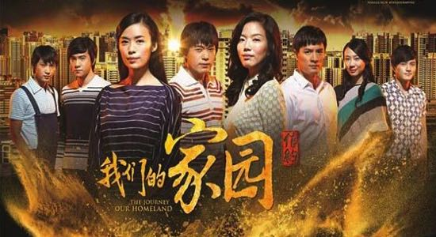
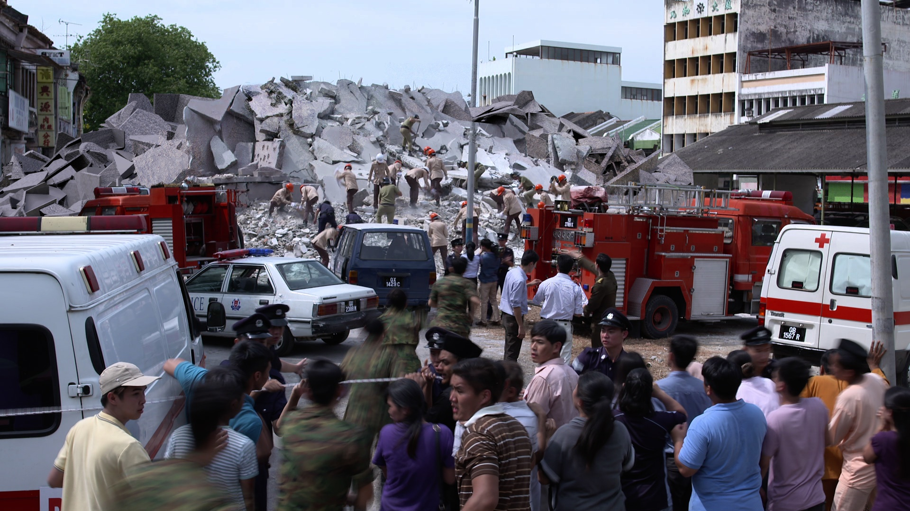

My 6-months Final Year Project was working on The Journey: Our Homeland, which is the third and final season of Mediacorp Channel 8's nation-building trilogy The Journey. 

I was in charge of the collapsing building shot which requires to have things breaking apart, smoke and debris. It was a challenge as it was a heavy VFX shot, I have to think of how to work across multiple softwares as I was using Maya for modelling and Houdini for the fracturing of the pieces, smoke and debris. As I was using both Maya and Houdini Engine, there was a compatibility issue due to using different softwares, one such example was that there was problem importing and exporting of files/swimming textures, I learnt how to adapt or fix technical issues along the way by trying various methods.

It was a great challenge as I was given a difficult scene, where I have to roughly model the layout of the room, and then make the ground collapse and also clean up the background plate and put everything together.

<iframe width="100%" height="255" src="https://www.youtube.com/embed/aGQN9QBJ1Io?start=114" frameborder="0" allow="accelerometer; autoplay; encrypted-media; gyroscope; picture-in-picture" allowfullscreen></iframe>

I had the privilege to go on site in Penang, where the filming took place and observe. I did the set extension, where the debris are modelled in maya and then composited in Nuke.

<iframe src="https://player.vimeo.com/video/207045390" width="100%" height="255" frameborder="0" allow="autoplay; fullscreen" allowfullscreen></iframe>

