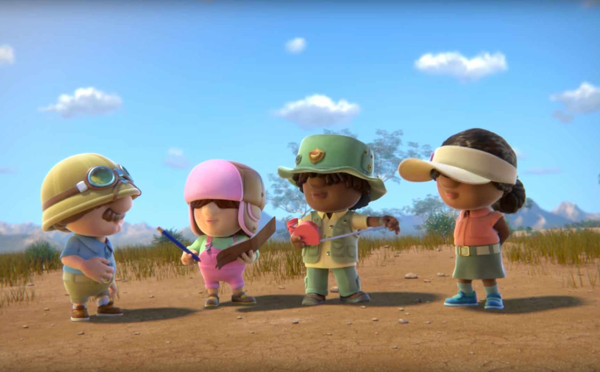

<iframe width="400" height="255" src="https://www.youtube.com/embed/4PS0LT_Uutk" frameborder="0" allow="accelerometer; autoplay; encrypted-media; gyroscope; picture-in-picture" allowfullscreen></iframe>

Working on Jungle Beats has been an eye-opener, especially working in a large pipeline production. I was able to learn a range of skills, from set dressing to fluid simulation and compositing with the guidance from the lead.

I was in charge of the splashes and ripple effects using FLIP Fluid simulation in Houdini, aided in set dressing and caches. I verified renders and handled communication between Batam and Singapore Division & Sunrise Animation. Not only that, I aid in setting up lighting for various characters and composited multiple shots, colour correcting and colour grading in Nuke according to the moodboard that Sunrise Animation provided.

