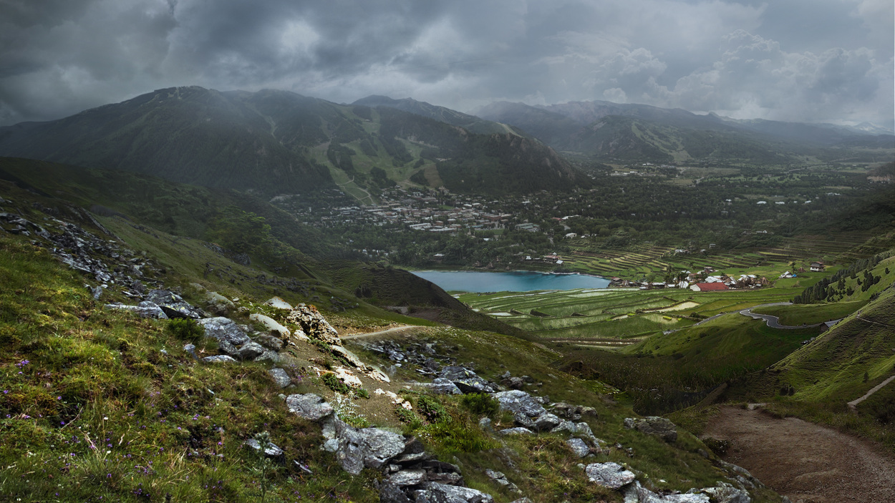
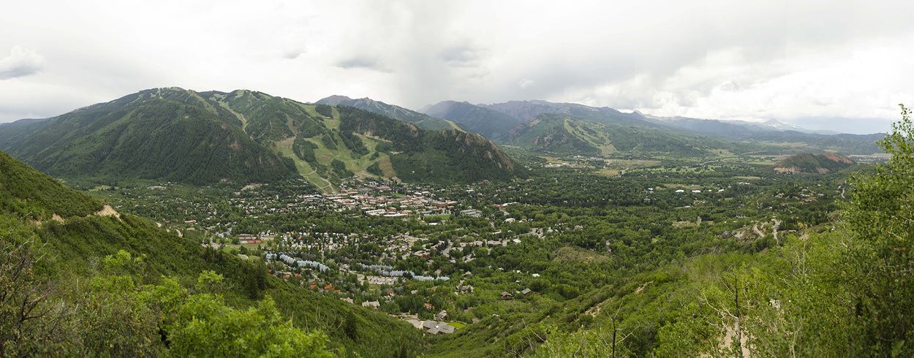
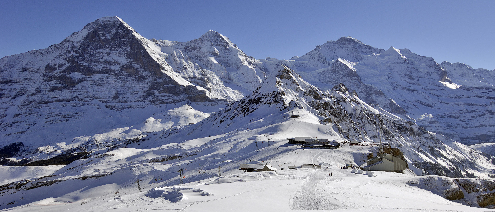
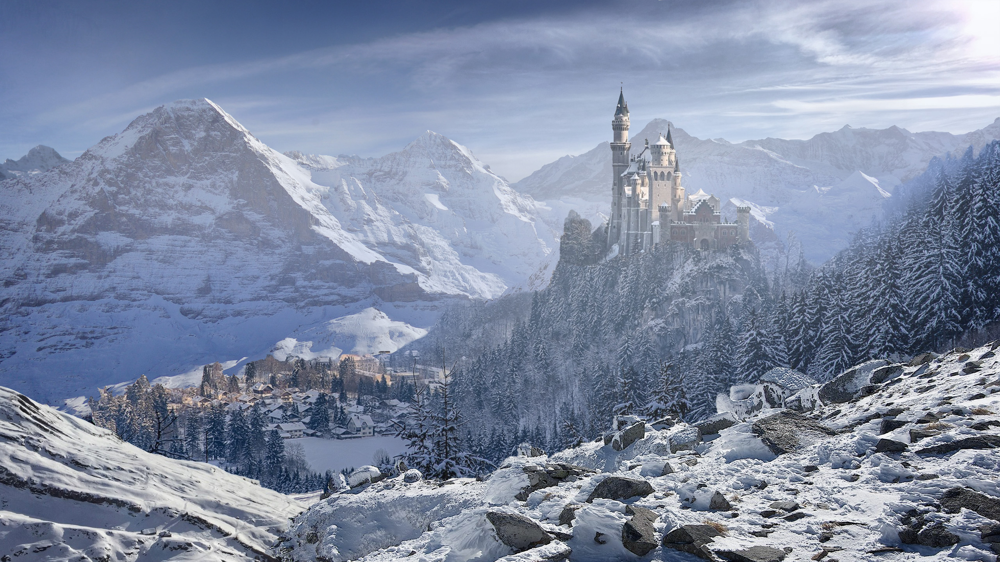
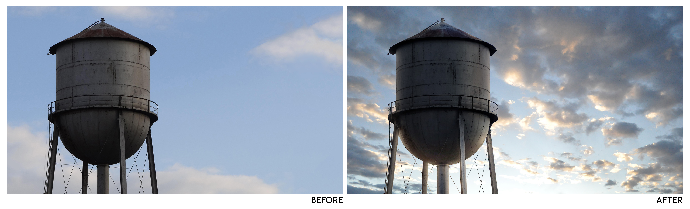
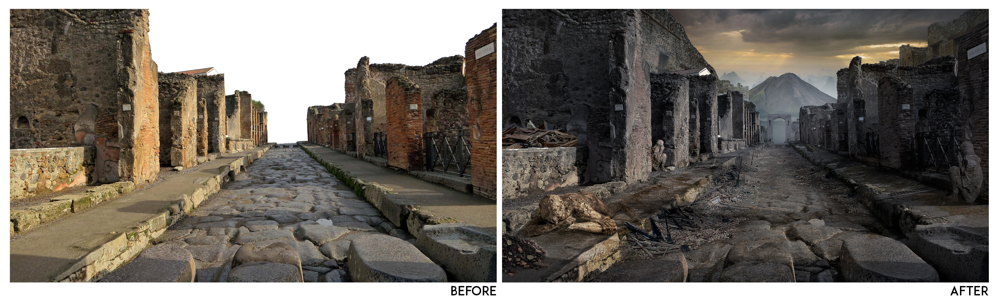
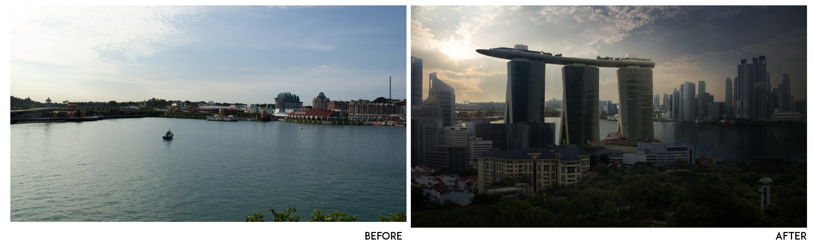

I have always enjoy doing digital photo manipulation, especially transforming from the base plate to something way different ever since school. I have explored a bit of 3D Matte painting using Nuke back then by projecting images onto the plane. Here are my before/after works:

Original background plate
 

<iframe src="https://player.vimeo.com/video/200559010" width="400" height="255" frameborder="0" allow="autoplay; fullscreen" allowfullscreen></iframe>

Original background plate
 

After

**All background images are not owned by me