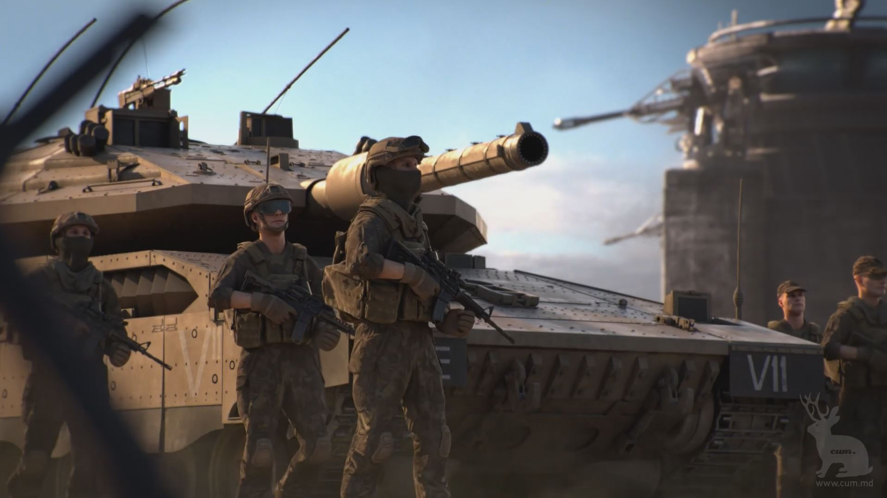
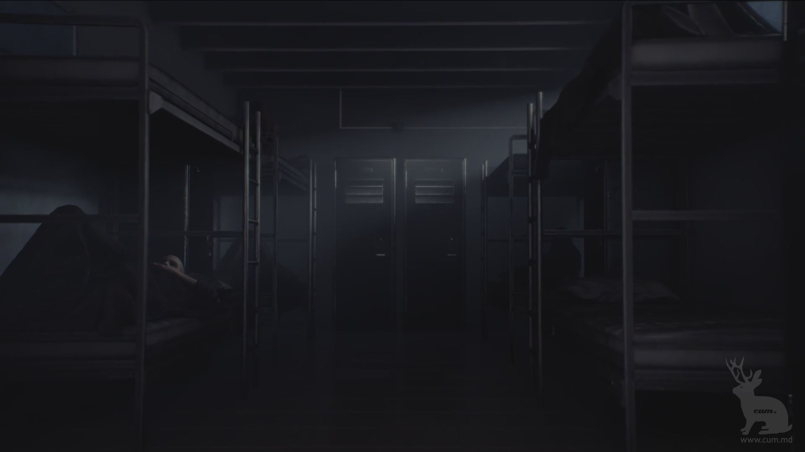
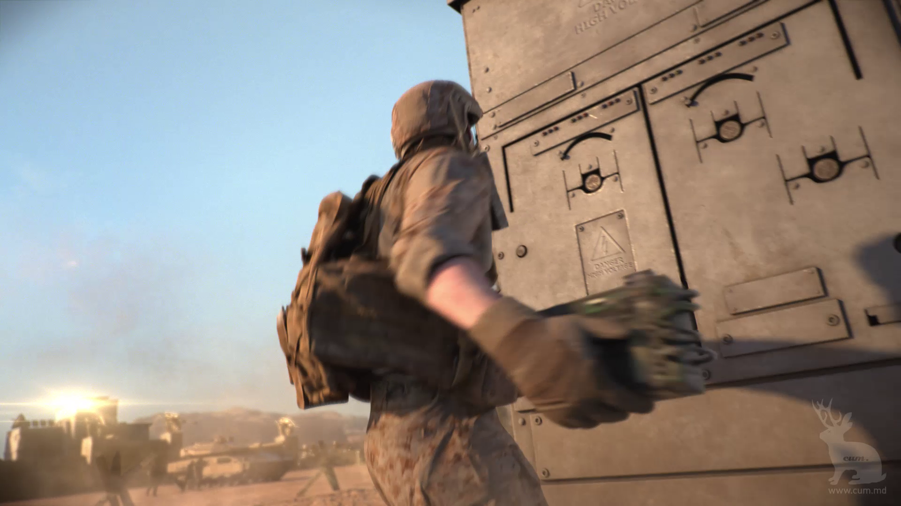
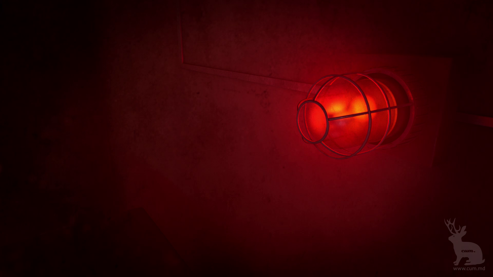
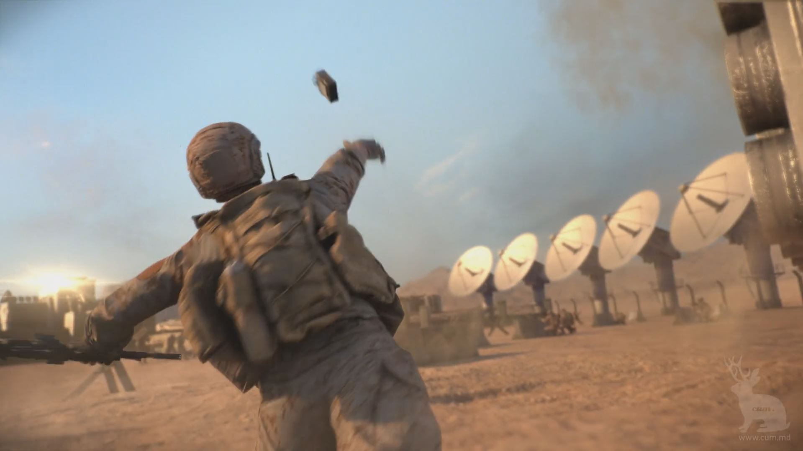

<iframe width="100%" height="255" src="https://www.youtube.com/embed/327ogEyV3Lo" frameborder="0" allow="accelerometer; autoplay; encrypted-media; gyroscope; picture-in-picture" allowfullscreen></iframe>

<i>Mobile Strike: Firefight promo</i>

I am glad to have been given the opportunity to work on this amazing project. This has been a really challenging project and I have learnt a lot, it has been an awesome time working with cum. m+d!

I was responsible for compositing a few heavy and complex shots. What I did was to motion track moving shots, composite different elements into one shot (matte painting, character, tanks) and further enhanced the shot with color correction.

I assisted in sending the 3D renders to the renderfarm and checking the quality of the renders, and the overall progress of all the shots (to see which one is ready for compositing, render errors).

