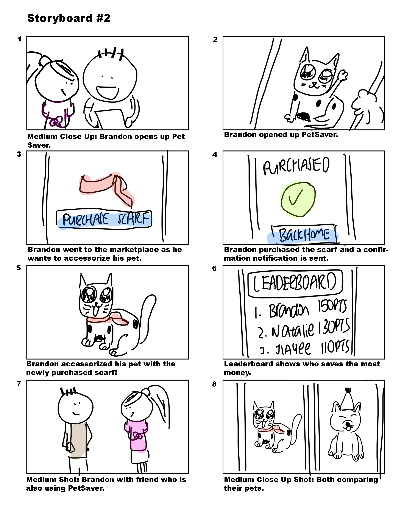

<iframe width="100%" height="255" src="https://www.youtube.com/embed/U7QycrOnMk4" frameborder="0" allow="accelerometer; autoplay; encrypted-media; gyroscope; picture-in-picture" allowfullscreen></iframe>

<i>PetSaver Promo video</i>

## Problem Statement

We decided to focus on youth with regards to personal finances and noticed the following main problems:

- Financial literacy not formally taught
- Lack of savings among millenials
- Lack of discipline to save

There are existing solutions or spending trackers such as Seedly that monitor the user's expenses and the categories.

However, they do not cater to a younger audience as they lack the discipline to use the application on a consistent basis.

## Approach

We came up with **PetSaver**, a mobile application that aid users in saving money through a gamified experience with the help of a virtual pet.

## User Study

<u>Our process:</u>
- Online survey
- User Interviews

<u>Targeted user groups:</u>
- Primary: Young Adults (21 ~ 25 y/o)
- Secondary: Teenagers (13 ~ 20 y/o)
 

### Online survey
- Shared link on various chat groups (Telegram, WhatsApp)
- Collected 108 responses in total

### User Interviews
- 3 face-to-face user interviews from targeted user groups
- Users were asked about their finance management
- We briefly introduced PetSaver as a solution as to not affect their mental model and gathered feedback and thoughts regarding the idea.

### Key Findings
- Respondents save their unspent money without a set target value
- Many do not keep track of finances
- Need regular reminders to encourage saving
- May not feel secure in letting the application handle savings
- May not have a bank account

## Next steps
Thus, for our application, we seek to have users to have the ability to customise saving goals and how they save, provide an incentive or motivation to be consistent in saving money as well as easing the process of transferring money.

We also realised that not everyone has a bank account or may feel secure in letting an application handle transfers, thus we also need to provide the user the freedom to choose however they want the application to do the 'saving' for them.

## Processing Data

### Affinity Diagram
We gathered our findings and organized the various ideas in our findings into groups or themes based on their relationship.

 

### User Personas

We came up wih two user personas in order to focus on the user's needs.
 

### Scenarios

We came up with storyboards for scenarios where The actor, Jia yi, in the scenario is able to easily sign up, set a target goal and interact with the cat. 
She is forced to save by making a transfer via our application to satisfy her pet cat.

For further motivation, it would be nice be able to have friends also involved. 
In this scenario, our actors are able to show off their pets to each other via a leaderboard system.

## Prototype

### <u>Process: </u>
- Designed 4 individual prototypes
- Gathered feedback (Formative evaluation)
- Designed 1 combined prototype
- Gathered feedback
- Designed final prototype (Figma)

 

### Individual prototype

Firstly, we each took on the responsibility of creating our own individual prototype as we envisioned the product to be, a mix of low-fidelity and high-fidelity prototypes. Those were given to 6 users to evaluate. 

Afterwards, we did a formative evaluation with the prototypes and combined the pros and eliminate the cons from the feedback and designed one combined prototype. Thereafter, we did user testing again with more people.

 

### Combined Prototype

After the evaluation, we started working on how our mobile app will look like, and these are some of the mockups that we did. 

For our evaluation process, our setting was just an evaluator as well as a tester who gives tasks or guides if necessary (but try not to). We also made sure that evaluators are able to vocalise their thoughts if they choose to (Concurrent Think Aloud approach), we also asked questions after each task in order to get responses and finding out what needs to be improved in the prototype.

The feedback was then gathered and we came out with a final prototype.
 

#### Scenarios Prototypes

- Registration process
- Purchasing clothes and equipping them
- Purchasing food
- Viewing leaderboard
- Viewing overview/achievements

## Evaluation
Throughout the process, we continuously evaluated the prototypes. We did this after the individual prototypes and the combined prototype.

It was a formative evaluation whereby we gathered the evaluator's immediate feedback and made appropriate changes for the next iteration.

We also attempted to apply the Nielsen Heuristics to serve as a guide whereby we tried to figure out if our prototypes complied or violated the heuristics. If a certain functionality violated the heuristics, we would try to fix it. We asked the evaluators what are the features they find appealing and and keep them in the combined prototype.

We then had a last round of evaluation to determine what further changes can be made.

<u>Changes made:</u>
- Added tutorials and tooltips
- Better notification dialogs
- Improved UI for (also made the system clearer)
- More interaction with pet

<i>Added interaction with pet</i>

## Conclusion

To summarize, our user study give us a better understanding of how people go about performing tasks and achieving goals that are important to them. This includes figuring out their pain points and things that they appreciate. 

Once the user study is done, we can also move on to the prototyping process. This helps us to ascertain the users’ needs. From there, we were able to gather even more feedback to fix what was wrong and to keep what was right by identifying gaps in design & usability. 

<b><a href="https://www.figma.com/proto/t4xCdlNXbTZZgaFvollWTr/Main-Screen?node-id=15%3A59&scaling=scale-down" target="_blank">Check out PetSaver on Figma!</a>

<a href="https://drive.google.com/file/d/1g8ksoIhvFQntttVYaH4djcn5jm7MiG9O/view" target="_blank">PetSaver Case Study</a></b>

