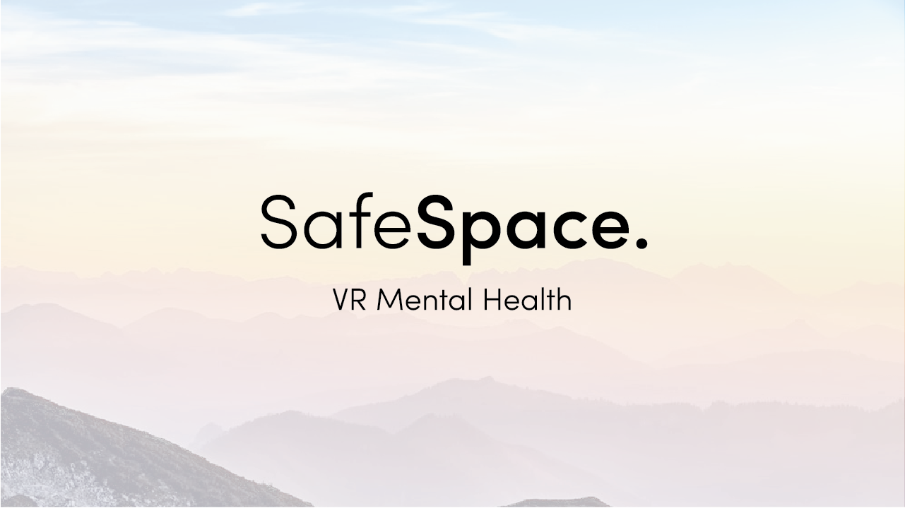
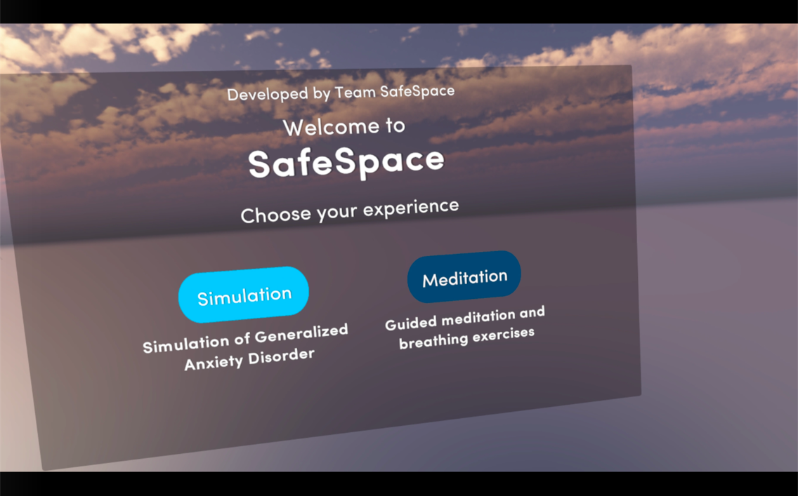
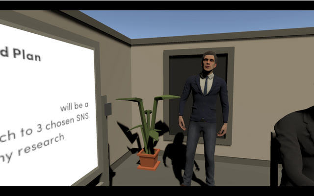
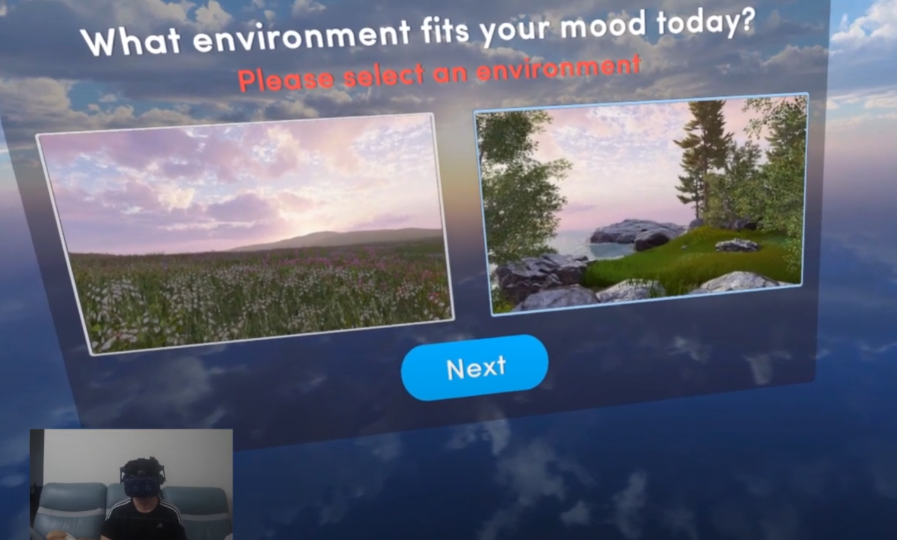

<iframe width="400" height="315" src="https://www.youtube.com/embed/DXkq3lLcZkI" title="YouTube video player" frameborder="0" allow="accelerometer; autoplay; clipboard-write; encrypted-media; gyroscope; picture-in-picture" allowfullscreen></iframe>

<i>Safespace Presentation & Promo video</i>

In collaboration with my CS4240 (Interaction Design for Augmented/Virtual Reality) team mates Arthur Lee, Darren Sim and Jaron Chan, we developed a VR Mental Health simulator and meditation guide that aims to bring a greater level of awareness and understanding of anxiety disorders through two main gameplay modes using Unity3D. 

**We got 2nd place in Interaction Design for Virtual and Augmented Reality out of 39 teams at the 16th eSTePS 2020.**

We made use of the HTC Vive Pro Eye for its advanced eye-tracking technology which was used to navigate our user interface through gazing at the buttons.

<i>Scenario played during the anxiety simulator</i>

What I have contributed to this project is that I have programmed the game event sequence, animation and panel transitions. I also worked on Environment Design & Lighting for meditation scenes. 

Not only that, I have programmed audio controls and volume controls which users can select or change audio at will during gameplay to improve user experience.

Lastly, I handled product presentation and promotion by editing promotional video.

<i>Players can choose the environment to meditate in</i>

<i>Meditation scene</i>

For more details about the project on the STePs website, check it out [here!](https://isteps.comp.nus.edu.sg/event/cs4240/module/AY2019-20+Semester_2+Task_1/project/7)