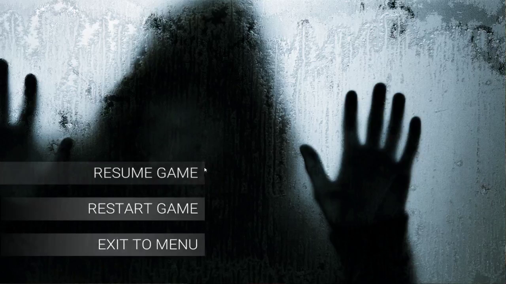

<iframe src="https://player.vimeo.com/video/326231416" width="400" height="225" frameborder="0" allow="autoplay; fullscreen" allowfullscreen></iframe>

This was my first time creating both a VR game and using Unreal Engine 4. Through this project, I was able to explore UE4's capabilities, from blueprint scripting to lighting and rendering and VR optimizing in UE4.

We built a survival zombie game where the goal is to stay alive as long as possible while being targeted by zombies and the main boss during our summer break. Our goal is to make it as immersive as possible and experience a FPS using a VR mounted headset and xbox controller. We achieved this by using different lighting techniques, shadows, post processing image effects and programmed triggers at location.

My contributions:

- Created & designed environment layout in the game using digital assets from UE4 Marketplace and integrated characters and animations from Mixamo and also background audio to use in the game.
- Developed triggers and first person camera system for the game using Unreal Engine's Blueprint system
- Designed the Heads Up Display (HUD) which contains of health & armour bar, hit screen, objectives, and change of objective in certain areas of the marketplace, a real time score timer that keeps track of how long the user is alive.
- Designed and developed a VR UI system using assets created in Photoshop and edited promotional video for SOLO.
