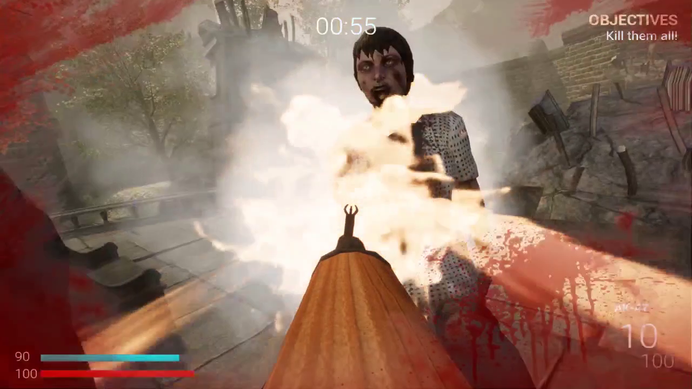
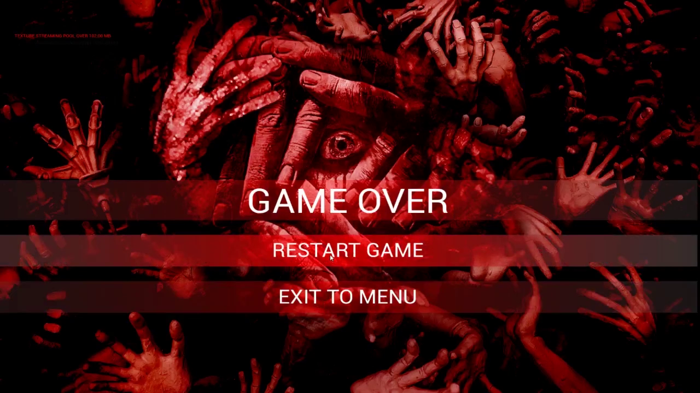
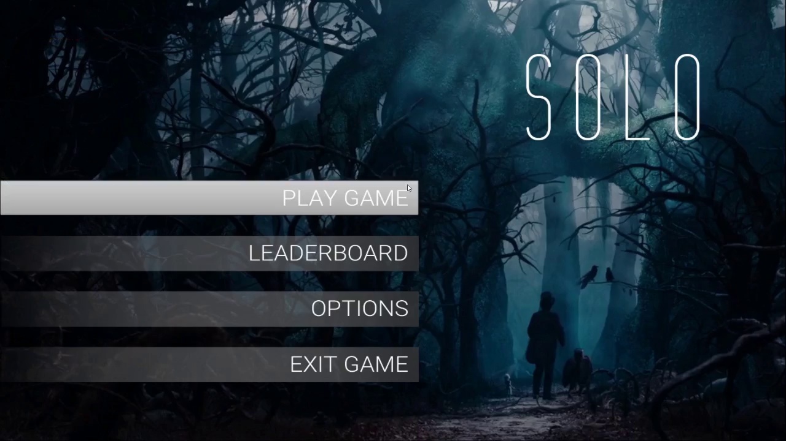

<iframe src="https://player.vimeo.com/video/326231416" width="400" height="225" frameborder="0" allow="autoplay; fullscreen" allowfullscreen></iframe>

This was my first time creating both a VR game and using Unreal Engine 4. Through this project, I was able to explore UE4's capabilities, from Blueprint Scripting to Lighting & Rendering and VR Optimization in UE4.

We built a survival zombie game during our summer break for Orbital Projet Apollo 11. The main objective is to stay alive as long as possible while being targeted by the main boss and enemies. Our goal is to make it as immersive as possible and experience a FPS using a VR mounted headset and Xbox controller.

We achieved this by using different lighting techniques, shadows, post processing image effects and programmed triggers at location.

I designed the environment and integrated characters, animations from Mixamo and background audio in the gameplay. 

I also developed triggers and first person camera system for the game using Unreal Engine's Blueprint system.

Not only that, I designed the Heads Up Display (HUD) which contains of health & armour bar, hit screen, objectives, and change of objective in certain areas of the marketplace, a real time score timer that keeps track of how long the user is alive.

I also designed and developed a VR UI system using assets created in Photoshop and edited promotional video for the project.

